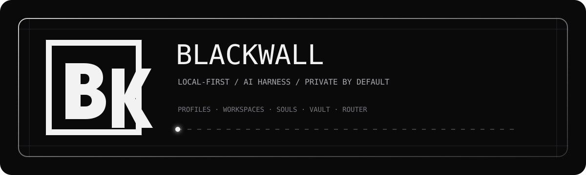
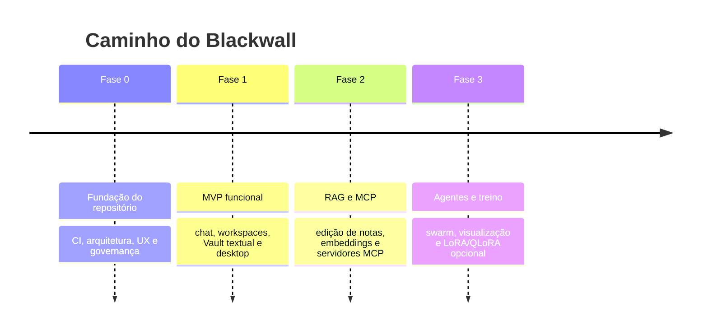
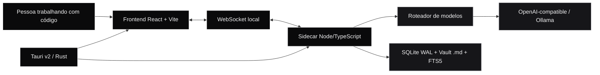
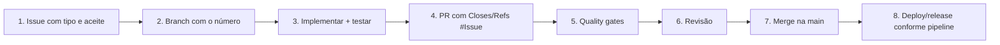

<p align="center">
  
</p>

<h1 align="center">Blackwall</h1>

<p align="center">
  Um harness de IA desktop, local-first e orientado a código — com contexto, notas e automação sob o controle do usuário.
</p>

<p align="center">
  
  
  
  <a href="https://github.com/MateusGaio/Blackwall./actions/workflows/quality.yml?query=branch%3Amain"></a>
</p>

<p align="center">
  <sub>Fase 1 funcional · fechamento da v0.1.0-beta · Fases 2–3 planejadas</sub>
</p>

> **Aviso de privacidade:** este repositório permanece privado durante a estabilização. Não inclua chaves, prompts, respostas, dados reais, dumps, caminhos pessoais ou conteúdo de workspaces em commits, Issues, Pull Requests, logs ou artefatos.

<p align="center">
  <a href="#o-que-é">O que é</a> ·
  <a href="#estado-atual">Estado</a> ·
  <a href="#comece-aqui">Comece aqui</a> ·
  <a href="#arquitetura">Arquitetura</a> ·
  <a href="#contribua-com-segurança">Contribua</a>
</p>

## O que é

O Blackwall reúne uma conversa persistente, contexto de projeto, perfis, **Souls**, workspaces, um Vault Markdown e um roteador de modelos em um aplicativo desktop local. A proposta é usar agentes e provedores diferentes sem transformar prompts, chaves e notas em dados de uma plataforma fechada.

### O produto em uma frase

```text
seu contexto + seus arquivos + seus provedores + suas regras
                              ↓
              um ambiente local para trabalhar com IA
```

### O que já existe na Fase 1

| Área | Entrega atual |
| --- | --- |
| Contexto | Perfis, workspaces vinculados a pastas, sessões sem workspace e Souls combináveis |
| Conversa | Chat com streaming WebSocket, parada preservando o texto parcial, fila FIFO e histórico local |
| Provedores | Endpoints OpenAI-compatible, Ollama, seletor de modelo e fallback sequencial para falhas transitórias |
| Arquivos | Anexos locais, extração de texto/PDF, FTS5 e leitura de Markdown com `[[wikilinks]]` |
| Permissões | Modos `ask`, `automatic` e `read-only` para ferramentas de workspace |
| Observabilidade | OTel sem exporter por padrão; telemetria opt-in com metadados técnicos somente |
| Desktop | Shell Tauri v2, runtime Node empacotado e bundles AppImage/`.deb` no Linux e NSIS no Windows |
| Captura | `/nota` explícito, nota Portent Markdown idempotente, relações validadas e desfazer por revisão |

> A leitura do Vault e o grafo de `[[wikilinks]]` fazem parte da base atual. Edição avançada, RAG semântico e MCP estão no roadmap; não são tratados como capacidades prontas nesta fase.

## Estado atual

O projeto está em **preparação de beta privada**. A **Fase 1 (MVP) está entregue**; o fechamento da `v0.1.0-beta` inclui hardening do runtime, auditoria de segurança/motion, checks Linux/Windows e release manual em draft. O repositório só poderá ser aberto após revisão de segurança, histórico, dependências, Actions, artefatos e proteção de branch.

> **Fonte viva do que vem depois:** [`ROADMAP.md`](./ROADMAP.md) — estado consolidado, trabalho em voo e próxima fase.

### Roadmap



## Princípios

- **Local-first:** perfis, sessões, configurações e notas vivem no dispositivo.
- **Privacidade por padrão:** prompts e respostas não entram em telemetria; exporters só existem com opt-in explícito.
- **Sem lock-in de notas:** o Vault usa arquivos `.md` reais e `[[wikilinks]]` compatíveis com Obsidian.
- **Falha transparente:** o roteador mostra o provedor em tentativa e explica o erro final depois do fallback.
- **Controle graduado:** ferramentas de workspace começam restritas e podem operar em `ask`, `automatic` ou `read-only`.
- **Interface focada:** tema OLED monocromático, motion intencional, skeletons, progresso e suporte a `prefers-reduced-motion`.

## Comece aqui

### Pré-requisitos

- Node.js e npm;
- Rust e os pré-requisitos da plataforma para Tauri v2;
- Git;
- um provedor OpenAI-compatible ou Ollama, quando quiser conversar com um modelo.

Consulte os guias oficiais de [Node.js](https://nodejs.org/), [Rust](https://www.rust-lang.org/tools/install) e [pré-requisitos do Tauri](https://v2.tauri.app/start/prerequisites/) para preparar o ambiente.

### Instalação

```bash
git clone <url-do-repositorio>
cd Blackwall
npm install
```

### Desenvolvimento no navegador

O modo web inicia o sidecar local automaticamente:

```bash
npm run dev
```

### Desenvolvimento desktop

```bash
npm run dev:desktop
```

O launcher verifica se já existe um servidor web/sidecar local e reutiliza a instância quando possível. Isso evita dois sidecars disputando a mesma porta durante o desenvolvimento.

### Dados locais e testes isolados

Os dados ficam em `~/.blackwall` por padrão. Para não misturar dados de desenvolvimento com um teste:

```bash
BLACKWALL_DATA_DIR="$(mktemp -d)" npm run dev
```

As chaves são armazenadas em `secrets.enc` e `secrets.key`, fora do SQLite e dos logs. Essa é uma proteção local por arquivo; um processo com o mesmo usuário do sistema ainda pode, em teoria, acessar ambos os arquivos.

## Arquitetura



| Camada | Responsabilidade |
| --- | --- |
| Tauri v2 / Rust | Janela, filesystem, runtime nativo e ciclo de vida do sidecar |
| React + Vite | Interface, navegação, chat, Vault, dashboard e estados de UX |
| Sidecar Node/TypeScript | Lógica de IA, roteador, streaming, ferramentas e persistência |
| SQLite em WAL | Perfis, workspaces, sessões, mensagens, provedores, modelos, anexos e aprovações |
| Vault Markdown | Notas reais em disco, leitura local e conexões por `[[wikilinks]]` |
| Sidecar Python | Futuro, opcional e restrito a LoRA/QLoRA na Fase 3 |

## Validação local

Antes de abrir um PR, rode os gates que se aplicam à mudança:

| Comando | O que verifica |
| --- | --- |
| `npm run check` | Biome, Knip, dependency-cruiser e testes Vitest |
| `npm run test:coverage` | Testes com relatório de cobertura |
| `npm run e2e:ci` | Fluxos críticos no Playwright em modo CI |
| `cargo check --manifest-path src-tauri/Cargo.toml` | Compilação do shell Rust |
| `npm run build:desktop` | Bundles Tauri para a plataforma atual |
| `npm run prepare:desktop-runtime` | Prepara o Node privado usado no pacote desktop |
| `npm run smoke:desktop-runtime` | Confirma que o runtime empacotado inicia sem Node no `PATH` |
| `npm run verify:release-version -- v0.1.0` | Confirma a versão sincronizada antes de criar a tag |
| `npm run mutation` | Teste de mutação agendado/sob demanda; não bloqueia todo PR |

O workflow de qualidade também executa os gates apropriados no GitHub. A `main` exige Pull Request, uma aprovação, `check`, `e2e` e `rust`, além de bloquear force-push, exclusão e merge com conversas pendentes.

## Variáveis úteis

| Variável | Uso |
| --- | --- |
| `BLACKWALL_DATA_DIR` | Troca a pasta de dados local, útil para testes isolados |
| `BLACKWALL_TOOL_CALL_BUDGET` | Ajusta o orçamento de chamadas de ferramenta; padrão `128`, máximo `512` |
| `BLACKWALL_NODE_RUNTIME` | Define qual executável Node será empacotado no desktop |
| `BLACKWALL_TELEMETRY` | Opt-in para `sentry`, `datadog` ou `newrelic`; ausente/desconhecida significa desativado |
| `BLACKWALL_TELEMETRY_ENDPOINT` | Endpoint OTLP/HTTP configurado pelo usuário para metadados técnicos |
| `BLACKWALL_SIDECAR_TOKEN` | Token efêmero do runtime local; gerado pelo launcher/Tauri a cada execução |

Exemplo de orçamento maior em uma sessão local:

```bash
BLACKWALL_TOOL_CALL_BUDGET=200 npm run dev
```

Nenhuma variável de telemetria deve ser configurada em uma contribuição sem documentar a finalidade e confirmar que prompts, respostas, chaves e caminhos não são enviados.

## Privacidade e segurança

- Não commite tokens, `secrets.enc`, `secrets.key`, bancos locais, logs ou conteúdo de workspace.
- Não envie prompts, respostas ou resultados de ferramentas para telemetria.
- Trate Issue, PR, log de CI e artefato como privados enquanto o repositório estiver em preparação.
- A beta não inclui updater automático; valide o checksum manual antes de instalar.
- Leia [`SECURITY.md`](SECURITY.md) antes de lidar com chaves, workspaces ou artefatos.

Relatos de vulnerabilidade devem seguir [`SECURITY.md`](SECURITY.md), e não uma Issue pública.

## Contribua com segurança

Toda tarefa — correção, melhoria ou função nova — segue o fluxo abaixo:



### Checklist rápido

- [ ] A Issue existe e tem `type:bug`, `type:enhancement` ou `type:feature`.
- [ ] A branch referencia a Issue, por exemplo `enhancement/121-readme-moderno`.
- [ ] O PR contém `Closes #<número>` ou `Refs #<número>` na descrição.
- [ ] Testes, Biome, Knip e dependency-cruiser foram executados.
- [ ] Mudanças de UI passaram pelo checklist de motion: skeleton, lazy loading, entrada/saída, progresso e `prefers-reduced-motion`.
- [ ] O diff não contém segredos, dados reais ou dumps locais.

Consulte [`AGENTS.md`](AGENTS.md) para as regras completas e [`CONTRIBUTING.md`](CONTRIBUTING.md) para o procedimento operacional.

## Mapa da documentação

| Documento | Para que serve |
| --- | --- |
| [`AGENTS.md`](AGENTS.md) | Regras para agentes, Issues, branches, PRs, qualidade e governança |
| [`PRODUCT.md`](PRODUCT.md) | Propósito, público, princípios e limites do produto |
| [`ARCHITECTURE.md`](ARCHITECTURE.md) | Stack, ADRs, fases e decisões técnicas |
| [`UX_SPEC.md`](UX_SPEC.md) | Navegação, estados, motion e identidade visual da interface |
| [`CONTRIBUTING.md`](CONTRIBUTING.md) | Guia de contribuição e quality gates |
| [`SECURITY.md`](SECURITY.md) | Política de segurança e preparação para publicação |
| [`SUPPORT.md`](SUPPORT.md) | Diagnóstico, suporte e instalação da beta |
| [`THIRD_PARTY_NOTICES.md`](THIRD_PARTY_NOTICES.md) | Inventário de dependências e avisos de terceiros |
| [`CHANGELOG.md`](CHANGELOG.md) | Histórico de versões e limites conhecidos |
| [`CODE_OF_CONDUCT.md`](CODE_OF_CONDUCT.md) | Regras de convivência da comunidade |
| [`LICENSE`](LICENSE) | Licença MIT |

## Licença

O Blackwall é distribuído sob a [licença MIT](LICENSE).
