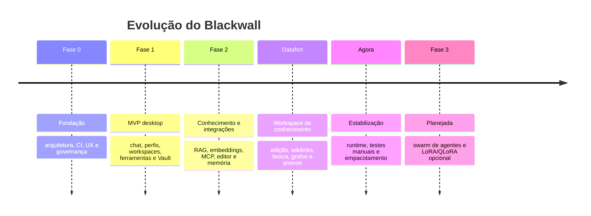
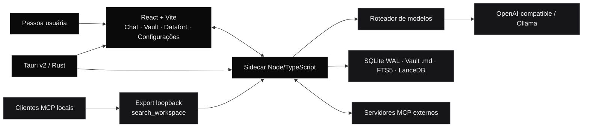

<p align="center">
  
</p>

<h1 align="center">Blackwall</h1>

<p align="center">
  Um workspace desktop, local-first e orientado a código para conversar com modelos, trabalhar com agentes e transformar arquivos locais em conhecimento útil.
</p>

<p align="center">
  
  
  
  <a href="https://github.com/MateusGaio/Blackwall/actions/workflows/quality.yml?query=branch%3Amain"></a>
</p>

<p align="center">
  <sub>Fases 1 e 2 implementadas no código atual · Datafort disponível · estabilização e aceite da beta em andamento</sub>
</p>

> **Aviso de privacidade:** este repositório permanece privado durante a estabilização. Não inclua chaves, prompts, respostas, dados reais, dumps, caminhos pessoais ou conteúdo de workspaces em commits, Issues, Pull Requests, logs ou artefatos.

<p align="center">
  <a href="#o-que-é">O que é</a> ·
  <a href="#o-que-já-existe">Recursos</a> ·
  <a href="#estado-atual">Estado</a> ·
  <a href="#comece-aqui">Comece aqui</a> ·
  <a href="#arquitetura">Arquitetura</a> ·
  <a href="#contribua-com-segurança">Contribua</a>
</p>

## O que é

O Blackwall reúne chat persistente, contexto de projeto, perfis, **Souls**, workspaces, ferramentas, memória e um ambiente de conhecimento local em um único aplicativo desktop. Ele permite alternar entre provedores e modelos sem entregar a uma plataforma fechada o controle sobre prompts, chaves, conversas e notas.

```text
seu contexto + seus arquivos + seus provedores + suas regras
                              ↓
               um workspace local para trabalhar com IA
```

## O que já existe

| Área | Entrega no código atual |
| --- | --- |
| Contexto | Perfis, Souls combináveis, workspaces vinculados a pastas e sessões sem workspace |
| Conversa | Histórico local, streaming WebSocket, Stop com texto parcial, fila FIFO, compactação de contexto e passos de ferramentas |
| Provedores | APIs OpenAI-compatible e Ollama, catálogo de modelos, escolha por conversa, uso observado e fallback sequencial |
| Ferramentas | Leitura, escrita e Bash sob políticas `ask`, `automatic` e `read-only`, com aprovações e orçamento por execução |
| Vault e RAG | Markdown real, watcher incremental, SQLite FTS5, embeddings Ollama/OpenAI-compatible, LanceDB, busca híbrida por RRF e citações verificáveis |
| Arquivos | Árvore do workspace, anexos de texto/PDF, preview seguro e artefatos gerados durante a sessão |
| Datafort | Workspace de conhecimento inspirado no Obsidian, com CodeMirror 6, abas, split, Source/Live Preview/Reading, propriedades, wikilinks, busca, grafos, anexos, templates, notas diárias e lixeira |
| MCP | Cliente para servidores externos com allowlist de ferramentas e servidor local somente leitura que expõe `search_workspace` por workspace |
| Memória | Captura automática opcional, redaction local, revisão de candidatos e separação entre preferências do perfil e conhecimento do workspace |
| Desktop | Shell Tauri v2, sidecar autenticado, runtime Node empacotado e bundles AppImage/`.deb` no Linux e NSIS no Windows |
| Observabilidade | OpenTelemetry sem exporter por padrão; integrações externas exigem opt-in e recebem somente metadados técnicos |

### Datafort e Vault não são a mesma superfície

- O **Vault lateral** serve para consultar arquivos, busca, citações e grafo enquanto o chat continua visível.
- O **Datafort** ocupa o workspace central para criar, editar e organizar conhecimento com uma experiência dedicada.
- Os dois trabalham sobre os mesmos arquivos locais e respeitam os limites do workspace selecionado.

## Estado atual

O Blackwall está em **estabilização da beta `v0.1.0`**. A Fase 1 estabeleceu o produto desktop e a Fase 2 adicionou indexação incremental, RAG, MCP, edição segura do Vault e memória contínua. O Datafort amplia essa base com um workspace completo de conhecimento local.

Essas capacidades já estão presentes na linha atual de desenvolvimento, mas a beta ainda passa por correções de runtime, testes manuais e consolidação das Pull Requests empilhadas. Não trate este estado como uma release estável nem como autorização para tornar o repositório público. Orquestração visual de múltiplos agentes e LoRA/QLoRA permanecem planejadas para a Fase 3.



O histórico e a decomposição das fases estão em [`ROADMAP.md`](ROADMAP.md). As decisões técnicas canônicas ficam em [`ARCHITECTURE.md`](ARCHITECTURE.md).

## Princípios

- **Local-first:** perfis, sessões, configurações, índices e notas vivem no dispositivo.
- **Privacidade por padrão:** prompts e respostas não entram em telemetria; exporters só existem com opt-in explícito.
- **Sem lock-in de notas:** o conhecimento permanece em arquivos `.md` reais, com `[[wikilinks]]` compatíveis com Obsidian.
- **Falha transparente:** erros de provedores, indexação e ferramentas devem ser visíveis e acionáveis.
- **Controle graduado:** o usuário escolhe a autoridade de ferramentas, MCP, memória e integrações por workspace.
- **Interface focada:** tema OLED monocromático, motion funcional, skeletons, progresso e suporte a `prefers-reduced-motion`.

## Comece aqui

### Pré-requisitos

- Node.js 24 e npm;
- Rust 1.77 ou superior;
- dependências nativas da sua plataforma para o Tauri v2;
- Git;
- acesso ao repositório privado;
- um endpoint OpenAI-compatible ou Ollama para conversar e, opcionalmente, gerar embeddings.

Consulte os guias oficiais de [Node.js](https://nodejs.org/), [Rust](https://www.rust-lang.org/tools/install) e [pré-requisitos do Tauri](https://v2.tauri.app/start/prerequisites/) para preparar o ambiente.

### Instalação

```bash
git clone https://github.com/MateusGaio/Blackwall.git
cd Blackwall
npm install
```

### Desenvolvimento no navegador

O modo web inicia o sidecar local automaticamente:

```bash
npm run dev
```

Abra `http://localhost:1420` se o navegador não abrir sozinho. O modo web existe para desenvolvimento e testes; o produto distribuído é o aplicativo desktop.

### Desenvolvimento desktop

```bash
npm run dev:desktop
```

O launcher exibe os logs no terminal de desenvolvimento. Ele só reutiliza um servidor web/sidecar local quando o HTML, o health check, o protocolo, o schema e o token autenticado pertencem ao mesmo build; se as portas estiverem ocupadas por outra instância, encerra com um diagnóstico claro. Isso evita misturar versões ou dois sidecars disputando a mesma porta durante o desenvolvimento.

Bundles AppImage, `.deb` e NSIS usam o runtime Node empacotado e não dependem do Node do sistema nem de um terminal aberto. O health check local inclui `buildId`, commit, versão, protocolo e schema para tornar incompatibilidades visíveis antes de uma chamada de produto.

### Primeiro uso

1. Crie ou selecione um perfil e uma Soul.
2. Adicione um workspace apontando para uma pasta local, ou comece uma conversa sem workspace.
3. Configure e teste um provedor em **Configurações → Provedores**.
4. Escolha um modelo no composer e inicie uma conversa.
5. Use o Vault lateral para consultar o workspace ou abra o Datafort para editar e organizar notas.
6. Ative embeddings, MCP ou memória somente quando quiser usar essas integrações.

### Dados locais e testes isolados

Os dados ficam em `~/.blackwall` por padrão. Para não misturar dados de desenvolvimento com um teste:

```bash
BLACKWALL_DATA_DIR="$(mktemp -d)" npm run dev
```

As chaves são armazenadas em `secrets.enc` e `secrets.key`, fora do SQLite e dos logs. Essa é uma proteção local por arquivo; um processo com o mesmo usuário do sistema ainda pode, em teoria, acessar ambos os arquivos.

## Arquitetura



| Camada | Responsabilidade |
| --- | --- |
| Tauri v2 / Rust | Janela, integração nativa, runtime empacotado e ciclo de vida do sidecar |
| React + Vite | Chat, navegação, Vault, Datafort, configurações e estados de UX |
| Sidecar Node/TypeScript | Modelos, streaming, ferramentas, RAG, embeddings, MCP, memória e persistência |
| SQLite em WAL | Perfis, workspaces, sessões, mensagens, configurações, projeções e auditoria técnica |
| Vault Markdown | Fonte de verdade do conhecimento exportável e compatível com outras ferramentas |
| SQLite FTS5 + LanceDB | Recuperação lexical e semântica local, reconstruível por workspace |
| Sidecar Python | Futuro, opcional e restrito a LoRA/QLoRA na Fase 3 |

O sidecar escuta apenas localmente, exige autenticação e é o único escritor do SQLite e do Vault. Interfaces não escrevem diretamente nos arquivos ou no banco.

## Validação local

Antes de abrir um PR, rode os gates que se aplicam à mudança:

| Comando | O que verifica |
| --- | --- |
| `npm run check` | Biome, Knip, dependency-cruiser e testes Vitest |
| `npm run test:coverage` | Testes com relatório de cobertura |
| `npm run e2e` | Fluxos críticos no Playwright |
| `npm run e2e:ci` | E2E isolado no formato usado pela CI |
| `cargo check --manifest-path src-tauri/Cargo.toml` | Compilação do shell Rust |
| `npm run build` | Frontend e sidecar de produção |
| `npm run build:desktop` | Bundles Tauri para a plataforma atual |
| `npm run prepare:desktop-runtime` | Prepara o Node privado usado no pacote desktop |
| `npm run smoke:desktop-runtime` | Confirma que o runtime empacotado inicia sem Node no `PATH` |
| `npm run verify:release-version -- v0.1.0` | Confirma a versão sincronizada antes de criar a tag |
| `npm run mutation` | Teste de mutação agendado/sob demanda; não bloqueia todo PR |

## Variáveis úteis

| Variável | Uso |
| --- | --- |
| `BLACKWALL_DATA_DIR` | Troca a pasta de dados local, útil para testes isolados |
| `BLACKWALL_TOOL_CALL_BUDGET` | Ajusta o orçamento de chamadas de ferramenta; padrão `128`, máximo `512` |
| `BLACKWALL_NODE_RUNTIME` | Define qual executável Node será empacotado no desktop |
| `BLACKWALL_TELEMETRY` | Opt-in para `sentry`, `datadog` ou `newrelic`; ausente/desconhecida significa desativado |
| `BLACKWALL_TELEMETRY_ENDPOINT` | Endpoint OTLP/HTTP configurado pelo usuário para metadados técnicos |
| `BLACKWALL_SIDECAR_TOKEN` | Token efêmero do runtime local; gerado pelo launcher/Tauri a cada execução |

Nenhuma variável de telemetria deve ser configurada em uma contribuição sem documentar a finalidade e confirmar que prompts, respostas, chaves e caminhos não são enviados.

## Privacidade e segurança

- Não commite tokens, `secrets.enc`, `secrets.key`, bancos locais, logs ou conteúdo de workspace.
- Não envie prompts, respostas, argumentos ou resultados de ferramentas para telemetria.
- Trate Issue, PR, log de CI e artefato como privados enquanto o repositório estiver em estabilização.
- A beta não inclui updater automático nem assinatura de código; valide o checksum antes de instalar.
- Acesso MCP local depende de token; qualquer processo local que obtenha esse token pode consultar os excertos permitidos.
- O modo `automatic` autoriza ferramentas com a autoridade normal do usuário do sistema e não equivale a uma sandbox.

Leia [`SECURITY.md`](SECURITY.md) antes de lidar com chaves, workspaces ou artefatos. Vulnerabilidades devem ser relatadas pelo canal privado indicado nesse documento, nunca em uma Issue comum.

## Contribua com segurança

Toda tarefa segue o fluxo **Issue → branch → implementação e testes → Pull Request → quality gates → revisão**.

### Checklist rápido

- [ ] A Issue existe e tem `type:bug`, `type:enhancement` ou `type:feature`.
- [ ] A branch referencia a Issue, por exemplo `fix/123-descricao-curta`.
- [ ] O PR contém `Closes #<número>` ou `Refs #<número>` na descrição.
- [ ] Testes, Biome, Knip e dependency-cruiser foram executados.
- [ ] Mudanças de UI passaram pelo checklist de motion: skeleton, lazy loading, entrada/saída, progresso e `prefers-reduced-motion`.
- [ ] O diff não contém segredos, dados reais ou dumps locais.

Consulte [`AGENTS.md`](AGENTS.md) para as regras completas e [`CONTRIBUTING.md`](CONTRIBUTING.md) para o procedimento operacional.

## Documentação

| Documento | Para que serve |
| --- | --- |
| [`PRODUCT.md`](PRODUCT.md) | Propósito, público, princípios e limites do produto |
| [`ROADMAP.md`](ROADMAP.md) | Histórico das fases, frentes em andamento e próximos passos |
| [`ARCHITECTURE.md`](ARCHITECTURE.md) | Stack, ADRs e decisões técnicas |
| [`UX_SPEC.md`](UX_SPEC.md) | Navegação, estados, motion e identidade visual |
| [`AGENTS.md`](AGENTS.md) | Regras para agentes, Issues, branches, PRs e qualidade |
| [`CONTRIBUTING.md`](CONTRIBUTING.md) | Guia operacional de contribuição |
| [`SECURITY.md`](SECURITY.md) | Política de segurança e preparação para publicação |
| [`SUPPORT.md`](SUPPORT.md) | Diagnóstico, suporte e instalação da beta |
| [`CHANGELOG.md`](CHANGELOG.md) | Histórico de versões e limites conhecidos |
| [`THIRD_PARTY_NOTICES.md`](THIRD_PARTY_NOTICES.md) | Dependências e avisos de terceiros |

## Licença

O Blackwall é distribuído sob a [licença MIT](LICENSE).
