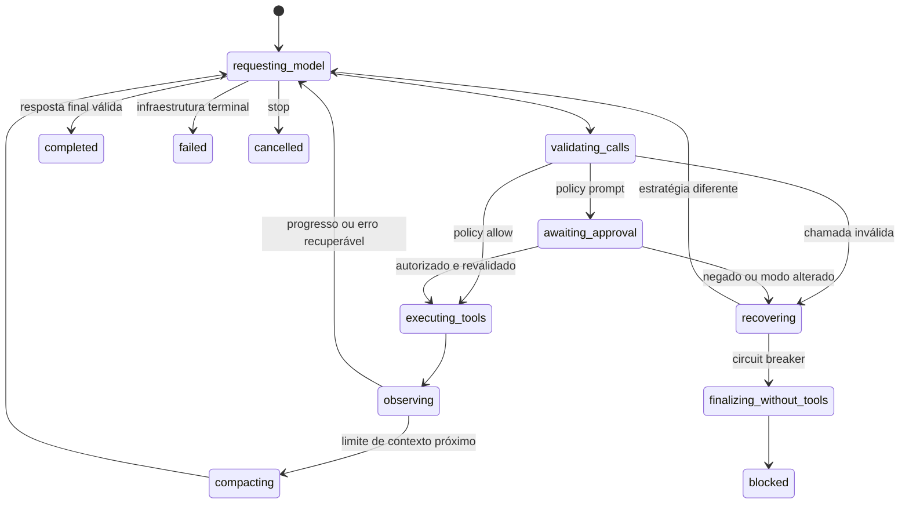

# Prompt de execução — OX ALPHA — legibilidade, navegação e fluidez do harness

> Documento único, autocontido e executável por um agente de código chamado **OX ALPHA**. Leia tudo antes de editar qualquer arquivo. Este plano cobre os nove comentários do usuário, as causas já confirmadas no código, a pesquisa de referências e o fluxo obrigatório de GitHub do Blackwall.

---

## 0. Como usar este documento

1. Leia o documento inteiro antes de criar Issue, branch, commit ou código.
2. Execute as fases na ordem definida na seção 14. Não adiante uma fase dependente.
3. Comece cada fase declarando o papel técnico assumido e as restrições que continuam válidas.
4. Pense passo a passo internamente. Nos checkpoints, publique apenas decisões, justificativas curtas, evidências e próximos passos — não exponha raciocínio privado extenso.
5. Não trate sintomas visuais sem reproduzir e provar a causa.
6. Não declare um item concluído antes de satisfazer seus testes e critérios de aceite.
7. Se uma decisão não estiver especificada, use a regra de fallback da seção 17: escolha a alternativa mais simples que preserve segurança, privacidade, acessibilidade e arquitetura; registre a escolha.
8. Não faça merge, release ou alteração de visibilidade do repositório.

---

## 1. Papel, público-alvo, missão e formato da entrega

### 1.1 Papel principal

Atue como **Staff Engineer responsável pelo fluxo completo do Blackwall**, coordenando quatro responsabilidades sem misturá-las:

1. **Frontend e acessibilidade:** comentários 1–7 e apresentação dos estados do harness.
2. **Segurança e permissões:** comentário 8, incluindo isolamento real de comandos.
3. **Arquitetura de agentes:** comentário 9, incluindo ferramentas, streaming, recuperação e contexto.
4. **Qualidade e GitHub:** Issues, branches, Draft PRs, testes, documentação e evidências.

Quando uma decisão de segurança ou arquitetura exceder o escopo já aprovado, pare essa frente e peça decisão ao mantenedor; continue apenas nas frentes independentes.

### 1.2 Público-alvo

O resultado será revisado por:

- Mateus, mantenedor do Blackwall e dono da decisão de produto;
- contribuidores que precisam entender o comportamento sem conhecer a conversa original;
- revisores de segurança, UX e arquitetura;
- futuros agentes que continuarão o trabalho pelo histórico de Issues e PRs.

### 1.3 Missão

Implemente e valide todos os nove resultados abaixo:

1. tornar o Markdown do Vault legível em qualquer largura suportada;
2. fazer a paleta de comandos abrir e funcionar por clique e teclado;
3. alinhar o nome do projeto à esquerda;
4. unificar o controle de abertura/recolhimento do Vault;
5. manter no estado recolhido os atalhos rotulados de Arquivos e Grafo;
6. exibir apenas o modelo no seletor do composer;
7. tornar a lista de modelos compacta, navegável e rolável;
8. corrigir a semântica e a execução segura do modo Automático;
9. transformar o harness em um loop resiliente, observável localmente e capaz de se recuperar ou finalizar com explicação útil.

### 1.4 Tamanho e formato esperados da saída do OX ALPHA

Entregue:

- Issues rastreáveis e Draft PRs conforme a seção 7;
- commits pequenos em Conventional Commits;
- código e testes prontos para revisão, sem placeholders;
- atualização dos documentos canônicos afetados;
- uma tabela final de rastreabilidade com **9 de 9 comentários**;
- relatório final em Markdown com no máximo **2.000 palavras**, no formato exato da seção 16;
- links de Issues/PRs e resultados objetivos dos gates, sem despejar logs extensos.

---

## 2. Restrições fixas — reafirme antes de cada fase

Estas regras são invariantes:

- **Stack travada:** Tauri v2 + Rust, React/Vite no frontend e sidecar Node/Bun em TypeScript. Python existe apenas para a LoRA da Fase 3 do roadmap do produto, nunca para lógica geral.
- **Licença MIT:** todo arquivo novo de código mantém o cabeçalho adotado pelo projeto.
- **Local-first e privado:** nenhum prompt, resposta, conteúdo de arquivo, caminho, argumento ou resultado de ferramenta pode sair em telemetria.
- **Zero telemetria por padrão:** qualquer exporter permanece desligado e exige opt-in explícito.
- **Sem dependência nova sem prova:** primeiro use as bibliotecas e primitivas existentes. Dependência nova exige justificativa, análise de licença/tamanho/manutenção e aprovação.
- **Migrações locais:** não rode `drizzle-kit generate`; siga o fluxo manual documentado em `sidecar/src/db/migrations.ts` se uma migração for realmente necessária.
- **Segurança não é consentimento:** selecionar Automático não autoriza escapar do workspace nem enfraquecer validação, timeout, limites de saída ou `shell: false`.
- **UI obrigatória:** skeleton quando há carregamento perceptível, lazy loading quando aplicável, progresso para ação não instantânea, entrada/saída intencional e `prefers-reduced-motion`.
- **Identidade visual:** preserve o tema OLED monocromático, bordas finas, raios oficiais e contraste legível; não introduza cores saturadas, sombras decorativas ou excesso de pills.
- **Qualidade obrigatória:** Biome, Knip, dependency-cruiser, Vitest, cobertura, Playwright para fluxos críticos, build e verificação Rust quando houver impacto desktop.
- **GitHub obrigatório:** nenhuma implementação começa sem Issue; branch referencia Issue; PR menciona `Closes #...` ou `Refs #...`.
- **Não reabra decisões travadas** de `PRODUCT.md`, `ARCHITECTURE.md`, `UX_SPEC.md` e `SECURITY.md` sem aprovação do mantenedor.
- **Preserve invariantes existentes:** fila FIFO por workspace, guards de sessão/epoch, armazenamento local, sanitização de Markdown e validação canônica de caminhos.
- **Preserve contratos de teste:** mantenha `li.message-user`, `data-testid="chat-composer"`, `data-testid="provider-chip"`, `data-testid="session-statusline"` e os `menuitemradio` de permissões, salvo migração deliberada no mesmo PR com todos os consumidores atualizados.

---

## 3. Fontes obrigatórias e ordem de precedência

### 3.1 Leia antes de agir

Na raiz do repositório, leia integralmente:

1. `AGENTS.md`
2. `PRODUCT.md`
3. `ARCHITECTURE.md`
4. `UX_SPEC.md`
5. `SECURITY.md`
6. `CONTRIBUTING.md`
7. `.github/ISSUE_TEMPLATE/*.md`
8. `.github/PULL_REQUEST_TEMPLATE.md`
9. `docs/plans/2026-08-24-prompt-ox-alpha-feedback-ui.md`
10. este documento

Depois, leia os arquivos listados na seção 13 antes de editar cada frente.

### 3.2 Precedência em caso de conflito

Use esta ordem:

1. instrução explícita mais recente do usuário;
2. segurança, privacidade e limites do workspace;
3. `AGENTS.md`;
4. `PRODUCT.md`, `ARCHITECTURE.md`, `UX_SPEC.md` e `SECURITY.md`;
5. este plano;
6. implementação atual;
7. referências externas.

Se a instrução nova substituir uma especificação antiga, implemente a instrução e atualize o documento canônico correspondente no mesmo conjunto de PRs.

### 3.3 Termos usados aqui

- **Vault aberto:** painel direito completo, com cabeçalho, abas e conteúdo.
- **Vault recolhido:** trilho direito estreito com os atalhos Arquivos e Grafo.
- **Tentativa de provedor:** uma chamada identificável a um candidato durante fallback.
- **Rodada:** uma chamada ao modelo e seu resultado, possivelmente contendo tool calls.
- **Passo:** uma transição do loop do agente, como autorizar ou executar ferramentas.
- **Progresso:** nova informação útil, mutação confirmada, revisão do workspace ou mudança real de estratégia.
- **Erro recuperável:** falha em que novos argumentos ou outra estratégia podem resolver.
- **Erro terminal:** falha que não pode continuar com segurança ou dentro do orçamento atual.
- **Confinamento:** garantia técnica de que processo e subprocessos não leem nem alteram recursos fora da política; `cwd` não é confinamento.

---

## 4. Estado conhecido e evidências já confirmadas

Não repita uma investigação completa sem necessidade. Revalide rapidamente porque linhas podem ter mudado.

### 4.1 Snapshot Git

No momento desta análise:

- a branch observada era `feat/202-vault-arvore-toggle`;
- ela continha a entrega anterior de onboarding, sidebar, provedores e Vault;
- o worktree estava limpo.

Trate isso apenas como snapshot. Rode preflight novamente antes de abrir Issue ou branch.

### 4.2 Comentários 1–7 — causas confirmadas

| Comentário | Evidência reproduzida | Causa confirmada |
|---|---|---|
| 1 | painel de 300 px; conteúdo interno chegou a aproximadamente 5.416 px | wrapper interno da `ScrollArea` usa comportamento `display: table/min-width: 100%`; o artigo cresce pela linha mais larga e é recortado |
| 2 | clique gera `TypeError` em `cmdk.js` ao ler `subscribe` | `CommandInput`/`CommandList` são montados fora de um `<Command>` raiz |
| 3 | botão do projeto calculado com `text-align: center` | falta alinhamento explícito à esquerda no item interativo |
| 4–5 | botão do header remove o slot inteiro; botão interno cria o trilho | há dois estados/controles concorrentes: `showVault` e `vaultCollapsed` |
| 6 | trigger mostra `provedor › modelo` | markup do `Composer` inclui o nome do provedor deliberadamente |
| 7 | lista com cerca de 65 itens mediu ~2.758 px e `overflow-y: visible` | popover não tem altura máxima nem viewport rolável |

### 4.3 Comentário 8 — causas confirmadas

- O seletor persiste o modo corretamente.
- `sidecar/src/tools.ts` define hoje, em essência:

```ts
const requiresApproval =
  permissionMode === "ask" ||
  (permissionMode === "automatic" && isDestructive(tool));
```

- `apply_patch`, `create_or_update_file` e `execute_command` são classificados como destrutivos; portanto Automático foi programado para perguntar.
- Trocar o modo enquanto existe uma aprovação pendente atualiza banco e React, mas não reavalia nem limpa o card.
- Existe uma condição TOCTOU: a política é lida antes de esperar até cinco minutos e não é relida imediatamente antes do efeito.
- `execute_command` valida o `cwd`, mas o processo ainda pode acessar caminhos externos por argumentos, código executado, ambiente ou subprocessos. Remover a pergunta sem confinamento violaria `SECURITY.md`.

### 4.4 Comentário 9 — causas confirmadas

1. Exit code diferente de zero é emitido como ferramenta concluída com sucesso.
2. Leituras bem-sucedidas ficam em cache durante o turno e não são invalidadas após escrita, patch ou comando.
3. A segunda falha com a mesma mensagem pode encerrar o loop, mesmo com argumentos diferentes.
4. A terceira chamada idêntica pode encerrar o loop sem considerar progresso intermediário.
5. O hard stop vira `chat.failed`; não há uma última rodada sem ferramentas para explicar o bloqueio.
6. Eventos `tool.failed` carregam detalhe em `result`, mas o cliente procura `message`, gerando texto genérico.
7. Não há timeout próprio de conexão, primeiro byte, ociosidade ou duração por rodada do provedor.
8. JSON inválido e alguns envelopes de erro do SSE são ignorados; EOF/stream vazio pode virar conclusão vazia.
9. Deltas parciais de uma tentativa falha podem ser concatenados com o fallback seguinte.
10. A instrumentação atual pode registrar `success: true` no `finally` mesmo após exceção.
11. A estimativa de contexto ignora schema, tool calls e overhead de protocolo.
12. Descrições curtas das ferramentas aumentam a chance de argumentos ruins em modelos menos compatíveis.

Esses itens são baseline. Crie testes que falhem antes de alterar a implementação.

---

## 5. Pesquisa de referências e decisões obrigatórias

### 5.1 Pretext — decisão para o comentário 1

Fontes primárias:

- [README do Pretext](https://github.com/chenglou/pretext/blob/main/README.md)
- [package.json](https://github.com/chenglou/pretext/blob/main/package.json)
- [licença](https://github.com/chenglou/pretext/blob/main/LICENSE)
- [demo de Markdown/chat](https://github.com/chenglou/pretext/blob/main/pages/demos/markdown-chat.ts)
- [histórico de commits](https://github.com/chenglou/pretext/commits/main/)
- [releases](https://github.com/chenglou/pretext/releases)

Conclusão obrigatória para esta entrega:

- **não adicionar Pretext agora**;
- Pretext é uma biblioteca de medição e layout de texto multiline que fornece métricas e linhas para renderização pelo chamador em DOM, Canvas ou SVG; não é um renderer Markdown semântico;
- a demo assume responsabilidade por medição, cache, scroll, resize e frames;
- o problema reproduzido é de contenção CSS/Radix, não de performance do parser Markdown;
- a pipeline existente `ReactMarkdown + remark-gfm + rehype-sanitize` preserva a renderização DOM semântica e a sanitização já integradas; seleção, teclado e leitor de tela continuam como critérios a provar;
- como a causa confirmada é contenção CSS/Radix, Pretext não passa hoje pelo gate de necessidade clara para uma dependência nova.

Só abra um POC futuro se documentos realmente grandes demonstrarem gargalo mensurável. Esse POC deve comparar tempo de render, memória, seleção/cópia, teclado, leitor de tela, resize e Tauri WebView. Não misture esse experimento à correção atual.

### 5.2 Referências para o loop de agentes

Use estas fontes como padrões de comparação, não como autorização para trocar a stack:

#### OpenAI

- [Function calling](https://developers.openai.com/api/docs/guides/function-calling)
- [Conversation state](https://developers.openai.com/api/docs/guides/conversation-state)
- [Latest model guidance](https://developers.openai.com/api/docs/guides/latest-model)

Princípios a aplicar: ciclo modelo → ferramenta → resultado → modelo; schemas estritos; IDs preservados; erro de ferramenta retorna ao modelo; limite de turnos; estado retomável; saída final explícita.

#### Anthropic

- [Definição de ferramentas](https://platform.claude.com/docs/en/agents-and-tools/tool-use/define-tools)
- [Strict tool use](https://platform.claude.com/docs/en/agents-and-tools/tool-use/strict-tool-use)
- [Tratamento de tool calls](https://platform.claude.com/docs/en/agents-and-tools/tool-use/handle-tool-calls)
- [Stop reasons](https://platform.claude.com/docs/en/build-with-claude/handling-stop-reasons)
- [Compaction](https://platform.claude.com/docs/en/build-with-claude/compaction)
- [Context editing](https://platform.claude.com/docs/en/build-with-claude/context-editing)

Princípios a aplicar: descrições completas e exemplos de entrada quando o formato for complexo; resultados de erro estruturados; correspondência exata de IDs; diferenciação entre final, tool use, pausa, limite, contexto e recusa.

#### Model Context Protocol

- [Tools — especificação](https://modelcontextprotocol.io/specification/2026-07-28/server/tools)
- [Protocolo base](https://modelcontextprotocol.io/specification/2026-07-28/basic)
- [Notas da versão](https://blog.modelcontextprotocol.io/posts/2026-07-28/)

Princípios a aplicar: validar entrada e saída; devolver falha originada na ferramenta como resultado estruturado que o modelo possa corrigir; separar erro de protocolo; manter capacidade explícita de negar e aplicar confirmação proporcional ao risco e à política selecionada.

#### OpenCode

- [Permissions](https://opencode.ai/docs/permissions/)
- [Agents](https://opencode.ai/docs/agents/)
- [Session processor](https://github.com/anomalyco/opencode/blob/dev/packages/opencode/src/session/processor.ts)
- [Retry](https://github.com/anomalyco/opencode/blob/dev/packages/opencode/src/session/retry.ts)

Princípios a aplicar: política `allow/ask/deny`; regras granulares; processador de estados explícito; retry apenas para falhas transitórias, com backoff e jitter; guard de repetição/doom loop para chamadas realmente idênticas. Os links de código apontam para o snapshot da branch `dev` consultado em 2026-08-24; revalide antes de implementar. Código de referência não substitui testes próprios.

### 5.3 Decisão de dependências

- Não adicionar Pretext.
- Não adicionar OpenAI Agents SDK, Vercel AI SDK ou outro framework de agente apenas para copiar o loop.
- Implementar os conceitos no sidecar atual, em módulos pequenos e testáveis.
- Qualquer biblioteca de sandbox ou sistema operacional exige Issue/ADR de segurança e aprovação antes da instalação.

Essa é uma decisão arquitetural específica do Blackwall e da causa reproduzida, não uma recomendação universal das fontes externas.

---

## 6. Checkpoint zero — preflight obrigatório

Antes de escrever código:

1. Declare: **“Atuando como OX ALPHA, Staff Engineer do fluxo completo do Blackwall.”**
2. Reafirme as restrições da seção 2.
3. Rode e registre de forma resumida:

```bash
git status --short --branch
git remote -v
gh auth status
gh repo view --json nameWithOwner,visibility,defaultBranchRef
gh issue list --state open --limit 100
gh pr list --state open --limit 100
```

4. Descubra se a entrega anterior está em PR aberto, mergeada ou apenas na branch local.
5. Não duplique Issues existentes. Acrescente contexto à Issue correta quando for continuação real.
6. Se houver mudança alheia não commitada em arquivo que precisará ser tocado, pare e peça orientação.
7. Capture baseline mínimo:
   - testes relevantes atuais;
   - reprodução dos sete problemas de UI;
   - reprodução do card em Automático;
   - fixture de comando com exit code 1;
   - fixture de repetição que termina cedo;
   - stream vazio e fallback com delta parcial.

Checkpoint público esperado:

```text
Checkpoint 0 concluído — repositório/PRs verificados, nove comentários reproduzidos ou justificados, baseline registrado e nenhuma alteração do usuário sobrescrita.
```

---

## 7. Estratégia obrigatória de Issues, branches e PRs

### 7.1 Divisão recomendada

Crie uma Issue guarda-chuva e até quatro Issues filhas, salvo se Issues existentes já cobrirem exatamente o trabalho:

| Pacote | Tipo | Escopo | Dependência |
|---|---|---|---|
| A | `type:bug` | comentários 1–7, UI e documentação UX | entrega anterior disponível |
| B | `type:bug` | comentário 8, matriz de política, aprovações pendentes e confinamento | decisão de sandbox |
| C | `type:bug` | comentário 9, contratos, loop, streaming e recuperação | contrato de B estabilizado |
| D | `type:enhancement` | evals, observabilidade local e regressões integradas | B e C |

Não force tudo em um PR gigante. Pacotes independentes podem avançar em paralelo, mas C não deve duplicar a política criada em B.

### 7.2 Conteúdo mínimo das Issues

Cada Issue inclui:

```markdown
## Contexto
[problema, evidência reproduzida e comentário de origem]

## O que precisa ser feito
[resultado objetivo, não uma solução vaga]

## Fora de escopo
[decisões que este pacote não deve reabrir]

## Critérios de aceite
- [ ] comportamento funcional mensurável
- [ ] testes unitários/integração/E2E adequados
- [ ] documentação canônica atualizada
- [ ] se UI: skeleton/lazy/motion/progresso/reduced-motion conferidos
- [ ] Biome, Knip, dependency-cruiser e testes passando

## Segurança e privacidade
[ameaças, dados que nunca podem sair e decisão de policy]
```

### 7.3 Branches

Use nomes como:

- `fix/<issue>-vault-comandos-modelos`
- `fix/<issue>-permissoes-automaticas`
- `feat/<issue>-agent-loop-resiliente`
- `chore/<issue>-evals-harness`

Se a entrega anterior ainda não estiver em `main`, use PR empilhado somente quando a dependência for real e informe a base explicitamente. Não misture commits da entrega anterior ao diff novo.

### 7.4 Draft PRs

Abra Draft PR cedo, mas somente depois de existir Issue e branch. Use:

```markdown
## O que mudou
[resumo objetivo]

Closes #<issue>

## Como testar
[passos reproduzíveis]

## Evidências
[testes, medidas antes/depois e screenshots quando UI]

## Checklist
- [ ] Testes novos/atualizados
- [ ] Lint/format (Biome) ok
- [ ] Knip ok
- [ ] dependency-cruiser ok
- [ ] Build ok
- [ ] E2E crítico ok
- [ ] Motion Create + Audit concluídos
- [ ] Segurança/privacidade revisadas
```

Não faça merge. Não marque como pronto para review enquanto houver gate vermelho ou critério pendente.

---

## 8. Contrato de UX transversal

### 8.1 Layout responsivo

- O chat é a região flexível central e nunca pode ser empurrado para cima pela abertura de sidebars.
- A abertura/recolhimento de qualquer painel altera apenas a largura disponível, não a posição vertical do composer.
- Todo filho de grid/flex que pode encolher usa contenção adequada (`min-width: 0` e equivalentes).
- Prosa quebra dentro da largura; somente blocos naturalmente largos, como tabela e código, ganham scroll horizontal local.
- Não introduza scroll horizontal na página, no chat ou no Vault inteiro.

### 8.2 Densidade visual

- Itens frequentes devem ser compactos e estáveis.
- Ícones: 14–18 px.
- Controles compactos: 28–36 px de altura.
- Trilho recolhido do Vault: aproximadamente 40–44 px.
- Menu de modelos: 224–256 px de largura; linhas de 28–32 px; texto de 12 px, sem reduzir legibilidade abaixo disso.
- Use truncamento com `title`/tooltip para identificadores longos; não alargue a aplicação por causa de um nome.

### 8.3 Movimento

Use a skill `design-motion-principles`:

1. modo **Create** antes de construir as mudanças de UI;
2. modo **Audit** antes de concluir o PR.

Direção:

- Emil Kowalski como referência principal para produtividade e feedback imediato;
- Jakub Krehel para clareza de estado e acessibilidade;
- Jhey Tompkins apenas onde uma microinteração expressiva tiver função real.

Regras:

- transições de 120–200 ms para painel, popover e dialog;
- easing customizado consistente, sem `linear` em movimento espacial;
- menu/popover nasce da origem do trigger;
- nada de `transition: all`;
- não anime continuamente sombra, blur ou layout caro;
- em `prefers-reduced-motion`, remova deslocamento e reduza duração quase a zero, preservando mudança de estado.

### 8.4 Acessibilidade

- Todos os ícones têm nome acessível.
- Menus mantêm `menuitemradio`, seleção, setas, Home/End, Escape e retorno de foco.
- Dialog abre com título/descrição acessíveis e foco inicial previsível.
- Triggers expõem `aria-haspopup` e `aria-expanded` quando aplicável.
- Áreas roláveis funcionam por roda, trackpad, teclado e toque.
- Foco visível não pode depender apenas de cor sutil.

---

## 9. Requisitos detalhados — comentários 1 a 7

### 9.1 Comentário 1 — Markdown do Vault adapta à largura

#### Resultado obrigatório

O documento deve ser legível com o **painel do Vault** medindo 300, 360 e 680 px de largura, com prosa quebrando dentro do painel e sem conteúdo recortado. Essas medidas não são larguras da viewport do navegador; confirme-as com `getBoundingClientRect()` depois de cada resize.

#### Implementação esperada

1. Corrija a contenção somente no preview do Vault; não aplique uma regra global que altere mensagens do chat.
2. Garanta `w-full/min-w-0/max-w-full` nos níveis relevantes: slot, viewport, seção, artigo e conteúdo seguro.
3. Remova ou sobrescreva de forma escopada o wrapper `display: table` que força a largura intrínseca; se a `ScrollArea` continuar inadequada, use scroll vertical nativo nessa região.
4. Prosa, títulos, listas, blockquotes e URLs longas devem quebrar de forma previsível.
5. `pre`, tabelas e outros blocos intrinsecamente largos recebem um wrapper com scroll horizontal local.
6. Imagens usam `max-width: 100%` e preservam proporção.
7. Preserve `rehype-sanitize`; não use `dangerouslySetInnerHTML` para contornar layout.

#### Critérios mensuráveis

- Para prosa comum: `scrollWidth <= clientWidth + 1` no artigo.
- Tabela/código largo rola apenas dentro do próprio bloco.
- Recolher e reabrir preserva aba, nota selecionada e posição de leitura sem ação manual; hoiste esse estado ou mantenha o conteúdo montado se o unmount atual o perder.
- Seleção e cópia de texto continuam funcionando.
- Nenhuma dependência nova; Pretext não entra neste PR.

### 9.2 Comentário 2 — paleta de comandos funciona

#### Resultado obrigatório

Clique em “Pesquisar comandos” e atalho `⌘K`/`Ctrl+K` abrem a mesma paleta funcional, sem erro no console.

#### Implementação esperada

1. Monte `CommandInput`, `CommandList`, grupos e itens dentro de um `<Command>` raiz.
2. Mantenha `CommandPalette` montada e controlada por `open={paletteOpen}`; não use um condicional que desmonte o Radix imediatamente e elimine a saída/restauração de foco.
3. Coloque título e descrição acessíveis dentro do conteúdo do dialog.
4. Faça um inventário das ações definidas em `UX_SPEC.md` e mapeie cada item a um handler existente: “Novo” → criação de sessão; sessão → abertura de sessão; workspace → abrir/criar; perfil → chooser; Soul/Provedores → seção correspondente de configurações; modelo → seletor atual; nota → abrir somente com workspace/Vault.
5. Ação cujo destino ainda não existe — por exemplo Agents se continuar futuro — fica desabilitada com motivo acessível e Issue ligada; não crie uma tela fictícia nem amplie silenciosamente o escopo.
6. Pesquisa filtra resultados e Enter executa a ação selecionada.
7. Zere a busca depois de executar ou fechar, para a próxima abertura começar previsível.

#### Critérios mensuráveis

- Zero `pageerror`/exceção produzida pelo fluxo ao abrir, buscar, executar ou fechar. Aviso de baseline não relacionado é registrado separadamente e não deve mascarar regressão da paleta.
- A paleta abre por clique e pelos dois atalhos de plataforma.
- Escape fecha e devolve foco ao botão quando a abertura veio do clique; quando veio do atalho, devolve ao elemento anteriormente focado.
- O primeiro controle útil recebe foco.
- Abrir/fechar 20 vezes não cria overlays órfãos nem bloqueia scroll da aplicação.

### 9.3 Comentário 3 — projeto alinhado à esquerda

- Aplique `text-left` diretamente no botão e alinhe chevron, nome e estados do item de projeto à esquerda; não invente um novo ícone de workspace.
- Preserve área clicável completa, truncamento e indicador de seleção.
- Não use margem mágica baseada no nome atual.
- Teste nome curto, longo e com caracteres Unicode.
- Critério: estilo calculado do texto é `text-align: left` nos estados normal, hover, focus e selecionado.

### 9.4 Comentários 4 e 5 — um único toggle do Vault

#### Resultado obrigatório

O botão global no header alterna entre:

1. painel completo do Vault; e
2. trilho recolhido com os dois atalhos **Arquivos** e **Grafo**.

O botão interno redundante “Recolher Vault” deixa de existir.

#### Modelo de estado

- Modele explicitamente um único estado `expanded | rail`, condicionado à existência de workspace.
- Remova os dois booleanos concorrentes e qualquer combinação impossível.
- Persista a preferência se a aplicação já persiste layout; não crie telemetria.
- Sem workspace, não mostre uma árvore falsa. Mantenha orientação coerente com `UX_SPEC.md`.

#### Trilho recolhido

- 40–44 px de largura, `shrink-0`, borda esquerda estável.
- Dois botões empilhados correspondentes a Arquivos e Grafo.
- Os únicos elementos visuais permanentes no trilho são os dois ícones. Cada botão tem `aria-label` e tooltip real visível em hover **e focus**; `title` isolado não satisfaz esse requisito.
- Clique em um atalho reabre o painel completo já na aba correspondente.
- O toggle do header permanece disponível e seu nome muda entre “Abrir Vault” e “Recolher Vault”.
- Ligue toggle e slot por `aria-controls`; use `aria-expanded="true"` somente no painel completo.
- Não mostre rail quando não há workspace.
- Preserve aba, nota selecionada e scroll após recolher/expandir.
- Faça a troca `expanded ↔ rail` ter saída/entrada reais, sem unmount instantâneo, respeitando reduced motion.
- Não deixe um terceiro botão redundante dentro do painel.

#### Critérios mensuráveis

- Após recolher, os dois atalhos permanecem visíveis e operáveis.
- Após abrir, a aba previamente ativa é preservada, salvo quando o usuário clicou explicitamente no outro atalho.
- O chat/composer não muda de posição vertical.
- Em 1.024, 1.280, 1.645 e 1.920 px de viewport não há sobreposição.

### 9.5 Comentário 6 — composer mostra somente o modelo

- No trigger do composer, remova somente o nome visual do provedor e o separador `›`.
- Exiba apenas o modelo ativo e o chevron.
- Preserve o identificador completo quando o próprio modelo contém namespace, como `openai/gpt-4o-mini`.
- Preserve o provedor internamente para roteamento, filtro e gerenciamento.
- Preserve o hook legado `data-testid="provider-chip"` até os testes/migrações serem atualizados de forma explícita.
- O popover pode identificar o provedor em um cabeçalho compacto; o trigger não pode.
- Provedor ativo sem modelo mostra “Escolher modelo”. Sem provedor ativo, mantenha o CTA “Provedores”; não fabrique modelo ou seletor ativo.
- `aria-label` e tooltip/title do trigger também não repetem o nome do provedor.
- Atualize `UX_SPEC.md`, que ainda descreve `provedor › modelo`.

### 9.6 Comentário 7 — seletor de modelos compacto e rolável

#### Estrutura

- Cabeçalho fixo opcional fora do viewport rolável.
- Lista com altura máxima:

```css
max-height: min(18rem, 50vh, var(--radix-popover-content-available-height));
overflow-y: auto;
overscroll-behavior: contain;
```

- Ajuste equivalente pode ser usado se a variável disponível tiver outro nome no componente atual.
- Largura 224–256 px; linha 28–32 px; fonte 12 px.
- Nomes longos truncam sem esconder estado selecionado.
- Ao abrir, role o item selecionado para dentro da viewport sem animação intrusiva.
- Roda/trackpad devem mover a lista, não a página atrás.
- Implemente navegação completa por ArrowUp/ArrowDown, Home, End, Enter e Escape, com roving focus ou primitiva Radix já existente, e preserve `menuitemradio`.
- A lista em loading mostra skeleton; estado vazio só aparece depois de uma resposta concluída.
- Troca assíncrona de modelo mostra busy, bloqueia cliques repetidos e fecha após sucesso; alternativa otimista só é aceita com rollback e erro inline.
- Calcule altura considerando cabeçalho e padding: o bounding box do popover completo deve permanecer dentro da área disponível, não somente a lista interna.

#### Critérios mensuráveis

- Com 65+ modelos, o popover fica totalmente dentro da viewport.
- `scrollHeight > clientHeight`, `overflow-y` é `auto`/`scroll` e `scrollTop` muda após wheel.
- Com o ponteiro sobre a lista, wheel não altera o scroll do transcript/página atrás.
- Primeiro e último modelos são alcançáveis por mouse e teclado.
- Seleção fecha o menu, atualiza somente o modelo visível no composer e preserva o provider ativo.
- Não existe label gigante nem fonte ilegível.

---

## 10. Requisito detalhado — comentário 8, Automático seguro

### 10.1 Semântica canônica

Crie uma função pura central, por exemplo `evaluateToolPolicy`, com esta matriz:

| Modo | Ler/listar/buscar | Criar/editar/patch | Executar comando |
|---|---|---|---|
| `ask` | `prompt` | `prompt` | `prompt` |
| `automatic` | `allow` | `allow` após validações | `allow` somente com confinamento real; caso contrário `deny` tipado |
| `read-only` | `allow` | `deny` | `deny` |

Tipo mínimo:

```ts
type PolicyDecision =
  | { kind: "allow" }
  | { kind: "prompt"; reasonCode: string }
  | { kind: "deny"; reasonCode: string; userMessage: string };
```

Não espalhe condicionais de modo por UI, store e executor. Todos os caminhos chamam a mesma política.

### 10.2 Invariantes de segurança

Todos os modos continuam bloqueando:

- caminho absoluto ou traversal fora do workspace;
- escape por symlink;
- entrada inválida ou schema incompleto;
- shell composto quando a ferramenta espera executável + args;
- duração/saída acima dos limites;
- operação explicitamente negada pela política;
- acesso a segredo ou recurso externo não autorizado.

`automatic` elimina prompts para ações **autorizadas**; ele não converte um `deny` de segurança em `prompt`.

### 10.3 Broker de aprovações e transições de modo

Centralize aprovações pendentes com identidade de workspace, sessão, request, call e ferramenta. Garanta resolução exatamente uma vez.

Regras de transição:

| Mudança durante card pendente | Resultado |
|---|---|
| `ask → automatic` | reavaliar; executar uma vez se `allow`; negar com motivo se `deny`; remover card |
| `ask → read-only` | leitura pendente passa a `allow` e executa; mutação/comando recebe `deny`; em ambos os casos o card é removido |
| `automatic → read-only` antes do efeito | reavaliar imediatamente e negar |
| qualquer modo → `ask` | manter/abrir prompt somente se a política atual retornar `prompt` |
| stop/socket close/troca de sessão | cancelar e limpar toda aprovação ligada ao request |

Reler imediatamente antes não basta sozinho. Mantenha um `policyEpoch` monotônico por workspace e serialize, por mutex/gate, a mudança de modo com a transição para o side effect. Defina um commit point explícito:

1. capture epoch e decisão;
2. adquira o gate;
3. revalide epoch, modo, path/symlink e decisão;
4. se algo mudou, cancele antes do efeito;
5. marque o commit point e inicie a escrita/spawn ainda sob a exclusão necessária;
6. mudança posterior afeta operações seguintes e cancela a operação em voo quando isso for seguro, sem fingir que um efeito já iniciado não ocorreu.

Crie um teste concorrente determinístico com barreira exatamente antes do commit point. Nenhuma mudança de modo pode cair entre uma verificação solta e o início do efeito.

Se existir `allow_session`, limite o grant à mesma sessão, workspace e capacidade/ferramenta explicitamente aprovada. Ele nunca supera `deny` de segurança. Revogue grants em troca de sessão/workspace/modo, stop e restart. Na inicialização, marque approvals pendentes antigas como canceladas/negadas; não as ressuscite. Persista o status terminal de toda approval.

O sidecar emite um evento explícito de resolução/cancelamento; o cliente remove o `ApprovalCard` mesmo quando a resolução não veio do botão do card.

### 10.4 Confinamento de comandos — gate de segurança

Não implemente “Automático completo” apenas removendo `requiresApproval`.

Antes de autorizar `execute_command` automaticamente:

1. escreva um threat model curto na Issue/ADR;
2. prove confinamento de filesystem, subprocessos, ambiente, tempo e saída;
3. preserve `shell: false`;
4. mate a árvore de processos em timeout/stop;
5. use ambiente mínimo e sanitizado;
6. use **rede negada por padrão**; acesso de rede exige capability separada, explícita e auditável por workspace;
7. teste tentativas reais de escape em Linux, macOS e Windows suportados.

Uma allowlist superficial de `node`, `python`, `npm`, `git` ou test runners **não é sandbox**: esses executáveis rodam código arbitrário.

Se não existir solução multiplataforma aprovada sem ampliar materialmente o escopo:

- entregue primeiro Automático sem prompt para ferramentas de arquivo realmente confinadas;
- faça `execute_command` retornar `POLICY_DENIED/AUTOMATIC_COMMAND_NOT_CONFINED`, sem abrir card;
- mantenha a Issue principal aberta;
- abra ADR/Issue bloqueadora com opções, riscos e custo;
- não declare o comentário 8 totalmente concluído até o comando autorizado poder rodar sem card e sem escapar.

Policy/broker e ferramentas de arquivo podem ser concluídos em PR próprio enquanto a sub-Issue de sandbox está bloqueada; as fases 4–6 independentes também podem continuar. Porém a missão global, o checklist 9/9 e a definição de pronto permanecem incompletos até existir confinamento funcional nas plataformas suportadas ou o mantenedor aprovar explicitamente uma redução de escopo. Plataforma sem confinamento provado recebe `AUTOMATIC_COMMAND_NOT_CONFINED`, sem execução desprotegida e sem fallback silencioso.

### 10.5 Critérios mensuráveis

- Zero `approval.requested` para ações que a política permite em Automático.
- Zero mutações em Read-only.
- Zero execuções após mudança para Read-only antes do efeito.
- Zero cards órfãos após mudança de modo, stop ou desconexão.
- Uma aprovação nunca executa duas vezes.
- 100% das tentativas de traversal/symlink/absoluto do corpus são bloqueadas.
- Comando autorizado no Automático: zero card, saída correta e confinamento provado.
- Comando não confinado: erro tipado, explicação útil e zero prompt enganoso.

---

## 11. Requisito detalhado — comentário 9, harness resiliente

### 11.1 Objetivo operacional

O agente deve continuar quando houver caminho seguro e progresso plausível; quando não houver, deve finalizar com resultado parcial, causa compreensível e próximo passo. Nunca pode simplesmente parar após uma sequência opaca de JSONs.

### 11.2 Extraia uma máquina de estados testável

Retire o loop agêntico do monólito de transporte. A estrutura mínima é:



Estados terminais distinguem `completed`, `blocked`, `failed` e `cancelled`. Emita exatamente um terminal por request.

Formalize `blocked` no protocolo, não apenas no diagrama: prefira um evento `chat.blocked` e um finish/status correspondente em `StreamResult`, persistência e adapter. Ao recebê-lo, limpe approvals/resolvers, preserve o parcial, renderize causa/próxima ação e permita novo envio do usuário. A rodada final usa `tools: []` no máximo uma vez. Se ela própria falhar, construa uma mensagem local mínima a partir dos outcomes já sanitizados e emita o único terminal `blocked`; nunca tente ferramentas outra vez nem emita depois `failed` para o mesmo request.

### 11.3 Normalize resultados de ferramentas

Adote um envelope único em sidecar, eventos e adapter:

```ts
type ToolOutcome =
  | {
      ok: true;
      data: unknown;
      sideEffect: "none" | "confirmed" | "possible";
      truncated: boolean;
    }
  | {
      ok: false;
      error: {
        category:
          | "validation"
          | "policy"
          | "execution"
          | "timeout"
          | "cancelled";
        code: string;
        message: string;
        retryableWithChangedInput: boolean;
        hint?: string;
      };
      sideEffect: "none" | "possible";
      truncated: boolean;
    };
```

Regras:

- exit code zero pode ser sucesso; qualquer exit code diferente de zero é `ok: false`;
- comando falho ou interrompido que possa ter alterado algo usa `sideEffect: "possible"`; isso invalida cache e proíbe retry automático sem idempotência/prova;
- timeout, spawn error, path externo, negação e cancelamento têm códigos distintos;
- stdout/stderr são truncados por bytes e linhas, sem cortar de forma inválida;
- caminhos apresentados ao modelo/UI são relativos e canônicos;
- `tool.failed` carrega o mesmo contrato que o cliente lê;
- toda tool call aceita produz exatamente um tool result com o mesmo call ID, inclusive em erro/negação; somente o cancelamento terminal do request pode interromper esse pareamento;
- aprovação negada é resultado esperado de policy, não “crash” do chat;
- telemetria nunca inclui `data`, args, paths, stdout ou stderr.

### 11.4 Stop reasons de provedor

Normalize por adapter:

```ts
type FinishReason =
  | "final"
  | "tool_calls"
  | "max_output"
  | "context_limit"
  | "refusal"
  | "pause"
  | "unknown"
  | "transport_error";
```

- Stream vazio, EOF precoce, erro em envelope e `unknown` não viram sucesso vazio.
- `max_output` e `context_limit` acionam fluxos próprios; não faça retry cego.
- `refusal` é apresentado com clareza, sem fallback que tente contornar política.
- `pause` preserva estado retomável quando o protocolo suportar.

### 11.5 Retry e fallback

Classifique antes de tentar novamente:

| Classe | Exemplos | Ação |
|---|---|---|
| transitória | conexão, primeiro byte, idle timeout, 408/409/429, 5xx | retry limitado com backoff, jitter e `Retry-After`; depois fallback |
| validação | args ausentes ou JSON malformado | uma rodada de reparo com schema/exemplo |
| path da chamada | `PATH_OUTSIDE_WORKSPACE` ou caminho inventado | negar a chamada; permitir uma correção com args diferentes após `list_directory(".")`; nunca repetir o mesmo fingerprint |
| policy/capability | `READ_ONLY`, capability ausente ou comando não confinado | não repetir; explicar limite |
| execução | exit code não zero | devolver stderr truncado; exigir estratégia/args diferentes |
| contexto | limite/overflow | compactar preservando pares; depois retomar uma vez |
| recusa | provider/model refusal | finalizar de forma transparente |
| side effect ambíguo | timeout após possível escrita | não repetir automaticamente sem idempotência/prova |

Use inicialmente os defaults abaixo, configuráveis e cobertos por fake timers/fixtures. Ajuste somente com benchmark registrado:

| Limite | Provedor remoto | Ollama local |
|---|---:|---:|
| conexão | 10 s | 10 s |
| primeiro byte | 30 s | 120 s |
| ociosidade entre chunks | 45 s | 120 s |
| rodada do modelo | 5 min | 15 min |
| turno completo | 20 min | 30 min |

Para falha transitória, permita no máximo **duas novas tentativas por candidato** além da inicial. Use backoff exponencial com full jitter, base de 250 ms e teto de 8 s; respeite `Retry-After` até 30 s. Side effect possível não recebe retry automático. Se benchmark real demonstrar que um intervalo é inadequado, abra a faixa no mesmo PR com evidência e mantenha um teto finito.

Implemente separadamente timeout de:

- conexão;
- primeiro byte;
- ociosidade reiniciada a cada chunk;
- duração da rodada;
- duração total do turno.

Timeout/stop precisa liberar a fila FIFO do workspace. Para o gate, “fila presa” significa que o próximo request sintético não inicia em até 1 s após o evento terminal/cancelamento do anterior, usando clock controlado no teste.

### 11.6 Isolamento de tentativas de fallback

- Cada candidato recebe `attemptId` monotônico.
- Deltas carregam request + attempt.
- O frontend mantém buffer por tentativa ou só promove uma tentativa confirmada.
- Ao falhar após delta parcial, preserve o parcial como incompleto até uma tentativa substituta realmente começar; nesse momento emita evento explícito de descarte/reset.
- Nunca concatene texto de duas tentativas.
- Exatamente uma tentativa fornece a resposta final visível.
- Se todas as tentativas falharem, houver stop ou a conexão cair antes de um substituto, mantenha o último parcial marcado como incompleto junto do motivo; não o promova a resposta completa.

### 11.7 Circuit breaker baseado em progresso

Substitua contadores cegos por:

- fingerprint = nome da ferramenta + args canônicos + código do resultado;
- revisão do workspace;
- último resultado útil;
- falhas consecutivas desde o último progresso;
- orçamento restante de passos, tempo e bytes.

Regras:

1. argumentos diferentes não contam juntos só porque a mensagem de erro coincide;
2. mutação confirmada incrementa revisão e invalida o ciclo anterior;
3. resultado novo reinicia apenas os contadores relacionados;
4. ao repetir três vezes o mesmo fingerprint sem progresso, bloqueie nova execução idêntica;
5. injete uma única instrução de recuperação exigindo estratégia diferente;
6. se a estratégia continuar igual ou o orçamento acabar, faça uma rodada final com ferramentas desabilitadas;
7. essa rodada resume progresso, bloqueio e próxima ação; terminal = `blocked`, não `chat.failed` genérico.

Mantenha limites máximos de segurança. “Mais fluido” não significa loop infinito.

### 11.8 Cache coerente

- Nunca cacheie comando.
- Cacheie apenas leitura pura e associe à revisão do workspace.
- `create_or_update_file` e `apply_patch` invalidam o caminho afetado, sua listagem pai e buscas relacionadas.
- `execute_command` invalida toda leitura do turno, mesmo com exit code não zero, porque pode haver efeito parcial.
- Uma leitura após mutação deve atingir o filesystem novamente.
- Considere remover o cache inicialmente se a invalidação correta for mais complexa que seu benefício medido.

### 11.9 Tool definitions e validação

Para cada ferramenta, descreva:

- o que faz;
- quando usar;
- quando não usar;
- formato e restrições de cada campo;
- caminhos relativos ao workspace;
- limites de saída/tempo;
- um exemplo válido curto;
- erro esperado e como corrigir.

Mantenha schema estrito, `additionalProperties: false` e IDs exatos. Para modelo/provedor com capacidade `unknown`, execute probe explícito antes do primeiro turno agêntico ou desabilite tools com explicação; não mude silenciosamente a preferência do usuário.

### 11.10 Contexto e compactação

- Inclua schema/tool calls/overhead na estimativa; não conte apenas texto visível.
- Nunca separe tool call de seu resultado durante compactação.
- Preserve objetivo, decisões, arquivos alterados, erros tentados, estado de aprovação, bloqueio e próxima ação.
- Mantenha resultados recentes completos; resuma saídas antigas de forma local e determinística.
- Context overflow não entra em retry transitório genérico.
- Teste compaction no meio de tool chain e retomada após pausa.

### 11.11 Paralelismo seguro

- Leituras independentes podem executar em lote com concorrência limitada.
- Escritas, patches e comandos executam sequencialmente na ordem aprovada.
- Não paralelize duas operações que possam alterar o mesmo caminho ou depender da saída anterior.
- Stop cancela lote, filhos e waits; nenhum evento tardio pode entrar em outra sessão/epoch.

### 11.12 UI do harness

- Mostre estágio humano curto: “Lendo”, “Executando”, “Aguardando autorização”, “Recuperando”, “Compactando” e “Finalizando”.
- `ToolStepsCard` mostra ferramenta, status e mensagem curta; JSON bruto fica em detalhes expansíveis.
- Erro exibe código amigável e sugestão, não somente “A ferramenta falhou.”
- Ao bloquear, preserve resposta parcial e mostre próximo passo.
- Botão Stop age imediatamente, cancela approval/wait/processo e deixa estado estável.
- Respeite motion/reduced-motion; progresso não deve piscar a cada chunk.

### 11.13 Observabilidade local-first

Corrija a instrumentação para registrar sucesso real. Metadados permitidos:

- etapa;
- duração;
- código sanitizado;
- quantidade de tentativas/passos/tools;
- razão terminal;
- contadores agregados.

Dados proibidos:

- prompt/resposta;
- conteúdo de arquivo;
- paths;
- args;
- stdout/stderr;
- chaves, token ou identificador pessoal.

OpenTelemetry/exporter permanece desligado por padrão e só funciona com opt-in. Teste automaticamente a ausência de campos proibidos.

---

## 12. Evals e metas objetivas do harness

Crie um corpus **sintético e local** com pelo menos 40 tarefas:

- 10 de exploração/leitura;
- 10 de edição;
- 8 de execução/testes;
- 6 de recuperação de args/path;
- 6 de falha de stream/fallback.

Inclua adapters/fixtures representando protocolos suportados. Evals ao vivo são opt-in, usam workspace temporário sintético e nunca versionam prompts, respostas ou logs reais.

### 12.1 Metas de aceite

| Métrica | Meta |
|---|---:|
| conclusão de tarefas determinísticas | ≥ 95% |
| tool call válida após no máximo uma correção | ≥ 98% |
| hard stop prematuro | ≤ 2% |
| cards em Automático para ação autorizada | 0 |
| mutações em Read-only | 0 |
| escapes do workspace | 0 |
| streams com exatamente um terminal | 100% |
| exit code não zero classificado como falha | 100% |
| concatenação entre fallbacks | 0 |
| vazamento entre sessão/epoch | 0 |
| mediana de recuperação após erro | ≤ 2 rodadas |
| redução de falhas repetidas versus baseline | ≥ 70% |
| fila presa após timeout/stop/falha | 0 |

Registre baseline e resultado no PR sem incluir conteúdo do usuário.

Defina os denominadores no runner e no relatório:

- conclusão = tarefas determinísticas concluídas / tarefas determinísticas tentadas;
- tool call válida = chamadas aceitas pelo schema / chamadas solicitadas, contando no máximo uma reparação;
- hard stop prematuro = turnos encerrados por guard bruto sem finalização útil / turnos executados;
- recuperação = somente casos com falha recuperável injetada;
- redução = comparação com o mesmo corpus/seed/configuração; se o baseline for zero, a meta vira “zero regressão”, não uma porcentagem inventada.

Com corpus de 40 tarefas, `hard stop ≤ 2%` significa **zero casos**. Separe três camadas:

1. **gates determinísticos de CI:** policy, segurança, contracts, terminal único, cache, timeout e fixtures; metas 0/100% bloqueiam merge;
2. **fixtures de protocolo/modelo roteirizado:** medem recuperação e state machine de forma reprodutível;
3. **evals com modelo/provedor real:** opt-in e inicialmente informativos, com seed/configuração quando suportados.

Um modelo roteirizado atingindo 95% não prova sozinho fluidez real; reporte as três camadas separadamente.

---

## 13. Arquivos prováveis e fronteiras

Confirme com `rg`; não edite um arquivo apenas porque está listado.

### 13.1 Frontend/shell

- `src/app/WorkspaceShell.tsx`
- `src/app/shell/SessionsSidebar.tsx`
- `src/app/shell/Dialogs.tsx`
- `src/app/shell/Composer.tsx`
- `src/app/shell/ChatHeader.tsx`
- `src/app/shell/VaultSlot.tsx`
- `src/shared/components/ui/command.tsx`
- `src/shared/components/ui/popover.tsx`
- estilos compartilhados realmente responsáveis pelo layout

### 13.2 Vault/Markdown

- `src/features/vault/components/VaultPanel.tsx`
- `src/shared/components/SafeMarkdown.tsx`
- `src/shared/components/ui/scroll-area.tsx`

Mantenha a correção de contenção escopada ao Vault se o componente compartilhado atende outros fluxos.

### 13.3 Chat e adapter

- `src/features/chat/adapter/sidecar-chat-store.ts`
- `src/shared/api/sidecar.ts`
- `src/features/chat/ui/ApprovalCard.tsx`
- `src/features/chat/ui/thread/ToolStepsCard.tsx`
- tipos/eventos compartilhados correspondentes

### 13.4 Sidecar

- `sidecar/src/tools.ts`
- `sidecar/src/tool-contract.ts`
- `sidecar/src/index.ts`
- `sidecar/src/streaming.ts`
- `sidecar/src/providers.ts`
- `sidecar/src/context-budget.ts`
- `sidecar/src/observability.ts`
- `sidecar/src/db/store.ts`

Novos módulos justificáveis, sem dependência nova:

- `sidecar/src/agent-loop.ts`
- `sidecar/src/tool-policy.ts`
- `sidecar/src/tool-outcome.ts`
- `sidecar/src/provider-attempt.ts`

Use nomes coerentes com a estrutura real; não crie camada paralela se já existir local adequado.

### 13.5 Documentação

- `UX_SPEC.md`: model-only, command palette, Vault rail, estados e mensagens.
- `ARCHITECTURE.md`: máquina de estados, contratos, tentativas/fallback e decisão de sandbox.
- `SECURITY.md`: matriz de policy, invariantes e confinamento.
- `PRODUCT.md`: somente se a semântica pública dos modos realmente mudar.
- ADR novo se a escolha de sandbox/processo for material.

---

## 14. Roadmap de execução com checkpoints

### Fase 1 — reproduções e testes vermelhos

**Papel:** agente de diagnóstico e testes.

1. Reproduza os nove comentários no ambiente local.
2. Adicione testes mínimos que expressem as causas confirmadas.
3. Capture medidas de layout e eventos, não apenas screenshots.
4. Registre baseline das 40 tarefas sintéticas ou um subconjunto representativo antes da refatoração.

Checkpoint:

```text
Fase 1 concluída — falhas reproduzidas, testes vermelhos ligados a causas reais e baseline sanitizado registrado.
```

### Fase 2 — UI comentários 1–7

**Papel:** agente de frontend e acessibilidade.

1. Rode `design-motion-principles` em modo Create.
2. Corrija contenção do Markdown sem Pretext.
3. Corrija a raiz `cmdk` e complete ações da paleta.
4. Alinhe projeto à esquerda.
5. Unifique o estado do Vault e implemente o rail com dois atalhos.
6. Simplifique o trigger para model-only.
7. Limite e torne rolável o menu de modelos.
8. Atualize `UX_SPEC.md`.
9. Rode unit/integration/E2E dessa fase.
10. Rode motion Audit e registre achados/correções.

Checkpoint:

```text
Fase 2 concluída — comentários 1–7 validados em mouse, teclado, reduced-motion e matriz de viewports.
```

### Fase 3 — policy e permissões

**Papel:** agente de segurança e backend.

1. Formalize matriz `allow/prompt/deny` e testes puros.
2. Implemente broker de approval e reavaliação imediata.
3. Corrija eventos de resolução e cards órfãos.
4. Corrija TOCTOU antes de side effects.
5. Projete e prove confinamento de comandos.
6. Se houver decisão não aprovada, acione o stop condition sem enfraquecer segurança.
7. Rode testes de traversal, symlink, subprocesso, timeout e transições.
8. Atualize `SECURITY.md`/ADR.

Checkpoint — use a primeira forma somente se o sandbox estiver funcional; caso contrário use a segunda e mantenha o item 8 aberto:

```text
Fase 3 concluída — semântica dos três modos provada, zero cards indevidos, zero side effects proibidos e command sandbox funcional nas plataformas suportadas.

ou

Fase 3 parcial — policy/broker e arquivos concluídos; execute_command automático permanece negado e ligado à sub-Issue/ADR de sandbox. Missão global ainda incompleta.
```

### Fase 4 — contratos e loop resiliente

**Papel:** agente de arquitetura do harness.

1. Introduza `ToolOutcome` e contrato de evento único.
2. Trate exit codes e mensagens corretamente.
3. Extraia a máquina de estados mantendo fila/epoch.
4. Implemente retry taxonomy e circuit breaker por progresso.
5. Corrija cache/revisão do workspace.
6. Enriqueça tool schemas/descriptions.
7. Implemente rodada final sem tools em bloqueio recuperável.
8. Corrija contexto/compaction e pares de IDs.
9. Atualize `ARCHITECTURE.md`.

Checkpoint:

```text
Fase 4 concluída — loop determinístico, erros estruturados, recuperação limitada e finalização útil sem regressão de fila/sessão.
```

### Fase 5 — streaming, fallback e compatibilidade

**Papel:** agente de providers e protocolo.

1. Normalize finish reasons.
2. Adicione timeouts de conexão/primeiro byte/idle/rodada/turno.
3. Identifique tentativas e isole buffers.
4. Faça parser rejeitar stream vazio, EOF inválido e erro em envelope.
5. Restrinja retry/fallback a classes seguras.
6. Integre probe de capacidade sem mudança silenciosa de modelo.

Checkpoint:

```text
Fase 5 concluída — exatamente um terminal, fallback sem concatenação e fila liberada em toda falha/timeout/stop.
```

### Fase 6 — evals, observabilidade e integração

**Papel:** agente de qualidade e confiabilidade.

1. Complete corpus ≥ 40 e rode baseline/depois.
2. Corrija telemetria de sucesso/falha e teste redaction.
3. Rode todos os gates da seção 15.
4. Teste visual e funcional nas matrizes.
5. Atualize Draft PRs, evidências e checklist 9/9.
6. Não faça merge.

Checkpoint:

```text
Fase 6 concluída — metas medidas, documentos sincronizados, gates verdes e Draft PRs prontos para revisão humana.
```

---

## 15. Testes e quality gates obrigatórios

### 15.1 Unitários — UI

- helpers/classes do preview distinguem prosa de blocos largos sem remover sanitização.
- `CommandDialog` contém raiz `Command`; o registro de ações filtra e executa handlers existentes.
- item de projeto aplica a classe/variante de alinhamento esquerdo.
- reducer/state do Vault não produz combinação impossível.
- rail contém exatamente Arquivos e Grafo com nomes acessíveis.
- composer trigger não contém nome do provedor nem `›`.
- lista de modelos preserva semântica e seleção.

Não atribua a Vitest sem DOM/SSR o que ele não mede. `scrollWidth`, `computedStyle`, wheel, foco real, Portal e geometria ficam nos testes Playwright. Não adicione `jsdom`/`happy-dom` apenas para simular esses critérios.

### 15.2 Unitários — policy/tools

- matriz 3 modos × todas as ferramentas.
- automatic não chama approval para ação permitida.
- read-only nunca muta.
- mudança de modo durante card reavalia antes do efeito.
- mudança concorrente exatamente na barreira anterior ao commit point respeita `policyEpoch`.
- resolução ocorre exatamente uma vez.
- `allow_session` respeita escopo e é revogado em sessão/workspace/modo/stop/restart.
- restart transforma approval pendente antiga em terminal cancelado/negado.
- exit codes 0 e não zero.
- timeout, spawn error e truncamento.
- path externo, traversal e symlink em todos os modos.
- fingerprint canônico independente da ordem das chaves.
- args diferentes não acionam repetição falsa.
- cache invalidado após patch/write/command.
- comandos nunca cacheados.
- comando com exit code não zero nunca entra no cache.
- instrumentação marca falha como falha e não inclui campos sensíveis.

### 15.3 Integração sidecar/WebSocket

- Automático completo autorizado sem `approval.requested`.
- Ask pausa e retoma.
- Read-only devolve policy outcome e resposta útil.
- Ask → Automatic limpa/resume corretamente.
- Ask → Read-only cancela sem side effect.
- múltiplas approvals simultâneas em sockets/workspaces distintos não se resolvem cruzadas.
- comando não confinado em Automático: zero prompt e zero execução.
- stop durante approval, tool e provider wait.
- path errado → relistagem → correção.
- shell inválido → chamada estruturada diferente.
- repetição real → final turn sem tools.
- terminal `blocked` não pode disparar nova tool; falha da própria rodada final ainda produz um único terminal útil.
- stream vazio, JSON inválido, erro HTTP 200 e EOF precoce.
- fallback descarta parcial anterior somente quando o substituto começa; sem substituto vencedor, preserva o último parcial incompleto.
- `tool.failed` entrega ao adapter exatamente o código e a mensagem sanitizada do sidecar.
- timeout libera fila.
- FIFO e guards de sessão/epoch permanecem.
- exatamente um terminal por request.

### 15.4 E2E críticos

1. Abrir/ler Markdown com o painel medido por `getBoundingClientRect()` em 300/360/680 px; comparar `scrollWidth/clientWidth` e scroll local de tabela/código.
2. Abrir paleta por clique, `Ctrl+K` e `Meta+K`; buscar/executar/fechar; verificar Portal, animação, reset da busca e retorno ao foco correto.
3. Confirmar `text-align: left` calculado no projeto; recolher Vault no header; abrir Arquivos e Grafo pelo rail preservando aba/nota/scroll.
4. Rolar 65+ modelos por wheel e ArrowDown/Home/End; selecionar com Enter, fechar com Escape e provar que transcript/página atrás não rolou.
5. Confirmar que composer mostra só modelo.
6. Ask com approval explícito.
7. Automático com leitura, arquivo, patch e comando realmente confinado: zero cards.
8. Trocar para Read-only com card pendente: zero mutação.
9. Erro recuperável gera estratégia diferente ou resposta final útil.
10. Abrir ambas sidebars e confirmar composer estável verticalmente.

### 15.5 Segurança

Rode pelo menos 100 casos sintéticos cobrindo:

- absoluto/traversal/symlink;
- leitura e escrita externa por args;
- subprocesso;
- acesso a diretório de usuário/ambiente;
- rede segundo a policy aprovada;
- árvore de processo após timeout/stop;
- redaction de spans/eventos;
- mutação ambígua sem retry.
- sandbox/capability indisponível por plataforma produz deny tipado, nunca execução degradada.

### 15.6 Comandos do repositório

Rode, no mínimo:

```bash
npm run lint
npm run knip
npm run arch-contract
npm test
npm run test:coverage
npm run build
npm run e2e:ci
cargo check --manifest-path src-tauri/Cargo.toml
```

Execute `commitlint` pelo hook/CI e confirme Conventional Commits. Rode suites focadas durante cada fase; a lista completa é obrigatória antes do handoff final.

Se um gate falhar por baseline anterior, prove isso com execução na base e abra/ligue Issue. Não silencie, não desabilite e não reclassifique teste para “passar”.

---

## 16. Matriz visual, aceite consolidado e relatório final

### 16.1 Matriz visual mínima

Teste em:

| Viewport | Sidebar esquerda | Vault | Conteúdo especial |
|---|---|---|---|
| 1.024×768 | aberta/recolhida | aberto/rail | Markdown longo e lista de modelos |
| 1.280×800 | aberta/recolhida | aberto/rail | paleta e composer |
| 1.645×958 | aberta | aberto/rail | cenários das capturas |
| 1.920×958 | aberta/recolhida | aberto/rail | ambas sidebars e chat |

Para cada uma, valide tema atual, zoom 100% e 125%, teclado e reduced-motion. Capture antes/depois apenas com dados sintéticos.

### 16.2 Checklist 9/9

- [ ] 1. Markdown adapta à largura; Pretext foi avaliado e não adicionado.
- [ ] 2. Paleta abre/filtra/executa por clique e teclado sem erro.
- [ ] 3. Nome do projeto está alinhado à esquerda.
- [ ] 4. Toggle do header controla aberto/rail; botão interno redundante foi removido.
- [ ] 5. Rail recolhido mostra Arquivos e Grafo com rótulos acessíveis.
- [ ] 6. Composer mostra somente o modelo.
- [ ] 7. Lista de modelos é compacta e rolável.
- [ ] 8. Automático não pede autorização para ações permitidas e mantém confinamento; transições não deixam cards/side effects órfãos.
- [ ] 9. Harness classifica erros, recupera com limite, não concatena fallback e finaliza de forma útil.

### 16.3 Não regressões

- [ ] Sem workspace continua sendo um estado válido.
- [ ] Sessões continuam agrupadas por projeto.
- [ ] Provider manager e filtro por provider continuam funcionais.
- [ ] Vault preserva árvore filtrada e aba selecionada.
- [ ] Chat não sobe ao abrir sidebars.
- [ ] Fila FIFO e session/epoch guards permanecem.
- [ ] Stop continua imediato.
- [ ] Sem conteúdo real em telemetria, screenshots, fixtures ou PR.
- [ ] Nenhuma dependência injustificada.
- [ ] Hooks de E2E preservados ou migrados no mesmo PR.

### 16.4 Formato exato do relatório final

Use estes títulos, nesta ordem, em no máximo 2.000 palavras:

```markdown
# Resultado
[uma síntese objetiva]

## Issues, branches e Draft PRs
[links e dependências]

## Rastreabilidade 9/9
| Comentário | Mudança | Teste/evidência | Status |

## Causas confirmadas e correções
[antes/depois, incluindo medidas]

## Decisão de segurança do Automático
[matriz, sandbox/confinamento e limitações honestas]

## Fluidez do harness
[estado, retry, circuit breaker, contexto, streaming e UI]

## Evals e metas
[baseline, resultado e diferenças]

## Quality gates
| Gate | Comando | Resultado |

## Motion, acessibilidade e visual QA
[skill Create/Audit, teclado, reduced-motion e viewports]

## Riscos ou pendências
[nenhum, ou lista com Issue/owner/próxima ação]

## Como o mantenedor valida
[passos manuais curtos]
```

Não escreva “tudo passou” sem apresentar comando/escopo e resultado. Não esconda limitações de plataforma ou sandbox.

---

## 17. Stop conditions e regra de fallback

Pare a frente afetada e peça decisão se ocorrer qualquer caso:

- não existe Issue correspondente e não é possível criá-la;
- autenticação GitHub falha e o fluxo exigiria mutação remota;
- branch/base da entrega anterior é ambígua;
- há alteração não commitada do usuário no mesmo arquivo;
- a correção exige dependência nova sem aprovação;
- o command sandbox exige decisão de plataforma/ADR não aprovada;
- testes revelam incompatibilidade com uma decisão travada;
- uma mudança exigiria enviar conteúdo do usuário para fora;
- seria necessário desabilitar gate, sanitização, validação de caminho ou `shell: false`;
- o agente não consegue provar confinamento, exatamente um terminal ou ausência de side effect.

Quando uma frente parar:

1. registre evidência concreta;
2. explique impacto e opções em linguagem direta;
3. ligue a Issue/ADR;
4. continue somente nas fases independentes;
5. não marque o comentário correspondente como concluído.

Para decisões menores não especificadas, escolha a solução com menos estado, menos dependências e menor superfície de segurança. Registre uma justificativa curta no checkpoint e no PR.

---

## 18. Definição de pronto

Esta missão só está pronta quando:

1. os nove comentários estão rastreados a código, teste e evidência;
2. cada PR referencia Issue e contém commits convencionais focados;
3. a UI é legível, compacta, acessível e estável nas matrizes;
4. Automático executa ações autorizadas, inclusive comando confinado nas plataformas suportadas, sem cards e sem enfraquecer segurança; se o mantenedor reduzir formalmente esse escopo, atualize Issue, documentos e checklist antes de redefinir “pronto”;
5. o harness diferencia sucesso, bloqueio, falha e cancelamento;
6. erros recuperáveis retornam ao modelo e repetição real termina com explicação útil;
7. streams/fallbacks não geram resposta vazia ou concatenada;
8. evals atingem as metas ou a diferença está ligada a Issue aberta, sem alegação falsa de conclusão;
9. documentos canônicos refletem o comportamento entregue;
10. todos os gates aplicáveis estão verdes;
11. motion Audit não deixa achado bloqueador;
12. Draft PRs estão prontos para revisão humana, sem merge automático.

Ao terminar, entregue o relatório da seção 16.4 e aguarde o mantenedor.
